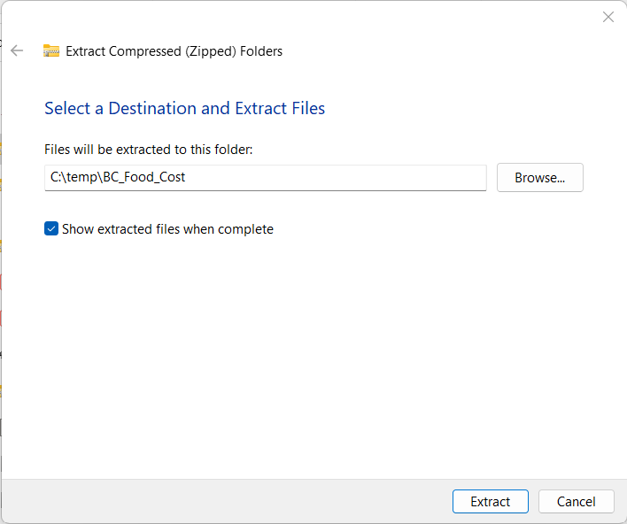
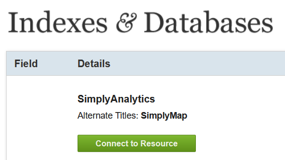

# Data Download and Setup
{: .no_toc }

1. TOC
{:toc}

---

# Create a New Project

Open up AcrGIS Pro and create a new project.  You can reference the same steps outlined in [Module 1](https://geos270.github.io/Module1/docs/Application_Part3_0.html) for help creating a project.

**1**{: .label .label-yellow } Name the project **BC_Food_Cost**

**2**{: .label .label-yellow } Create a new "Feature Dataset" called **BC_Census_Data**
* Make sure the feature dataset is in the "NAD 1983 BC Environment Albers" projection
* See the video below for guidance

  <iframe src="content/videos/Setup.mp4" title="Processes" scrolling="no" frameborder="0"
    style="border: 0;
   height: 100%;
   left: 0;
   position: absolute;
   top: 0;
   width: 100%;">
   
Your browser does not support iframes.

 </iframe>

<a href="content/videos/Setup.mp4" target="_blank">View Image in New Tab</a>

## Download the BC Boundary File

**3**{: .label .label-yellow } Click the button below to download the BC_Boundary.zip file.
* Extract the contents of the BC_Boundary.zip file to your newly created **BC_Food_Cost** project folder.

[Download](https://github.com/GEOS270/Module3/raw/main/data/BC_Boundary.zip){: .btn .btn-blue }

**4**{: .label .label-yellow } Import the **BC_Boundary** shapefile to your **BC_Census_Data** feature dataset.
* Start by adding the BC_Boundary.shp to the map
	* Check the **Spatial Reference System**
	* Check the **Attribute Table**
	* Remove it from the Table of Contents
* Right click the **BC_Census_Data** feature dataset
	* Select: Import > Feature Class(es)
	* Choose BC_Boundary.shp then click Okay
* The newly import BC_Boundary Feature class should automatically be added to your table of contents
	* Inspect the coordinate system to see if it changed
	* You can then delete the original shapefile

  <iframe src="content/videos/Import.mp4" title="Processes" scrolling="no" frameborder="0"
    style="border: 0;
   height: 100%;
   left: 0;
   position: absolute;
   top: 0;
   width: 100%;">
   
Your browser does not support iframes.

 </iframe>

<a href="content/videos/Import.mp4" target="_blank">View Image in New Tab</a>

---

# Downloading Census Data

We are gong to download population estimates for 2021 using [Simply Analytics](https://resources.library.ubc.ca/page.php?id=1044).  You can also find it by Googling "Simply Analytics UBC Library".  One of the first results will be the Library Indexes & Databases page.

**1**{: .label .label-red } On the library page, click "Connect to the Resource".  This will redirect you to the simply analytics logon page.  

**2**{: .label .label-red } Click the link to create a new account.  **Note** you have to connect via the library, otherwise you will be need to login via the UBC VPN first.

Once you're setup, you can download the data.  The video below walks you through using the simply analytics interface.  We are going to download the following data: 

* **Total Population (2021)**
* **Median Household Income (2021)**
* **Average Total Expenditures on Food (2021)**.  

The steps outlined in the video are:

**1**{: .label .label-blue } Create your project to query data.

* Select study area and inspect default variables.
* Explore the interface.
* Watch intro video on Simply Analytics.

**2**{: .label .label-blue } Query additional variables.

* Search for food cost.
* Make sure to select the correct variable.

**3**{: .label .label-blue } Export the data.

* Save the project so its easy to come back if needed.
* Export the shapefile.
	* Make sure all variables are checked.
	* Make sure to export **Census Subdivisions**.

**4**{: .label .label-blue } Check your email for the download link.  Clicking it will downloaded a .zip folder with a name that starts with "SimplyAnalytics_Shapefiles_" followed by a bunch of gibberish

* Extract the contents of SimplyAnalytics_Shapefiles .zip file to your newly created **BC_Food_Cost** project folder as well.

<iframe width="560" height="315" src="https://www.youtube.com/embed/eEtLTafGxbM" title="YouTube video player" frameborder="0" allow="accelerometer; autoplay; clipboard-write; encrypted-media; gyroscope; picture-in-picture" allowfullscreen></iframe>

---

# Pre-Processing

## Importing the Census Data

We have to do a few things to the data to make sure everything setup and ready so we can conduct our analysis.

**1**{: .label .label-green } Import the **SimplyAnalytics_Shapefiles** using the same steps [as above](#download-the-bc-boundary-file) and name it **BC_Census_Data**

* Make sure to check the **Spatial Reference System** before and after the import.  Think about:

	* What coordinate system the census data came in from Simply Analytics?
	* What coordinate system we're using and **why**.
* You can delete the original SimplyAnalytics_Shapefiles, but **Do Not** delete **variable_names.txt**, we still need it!

**2**{: .label .label-green } Rename the **SimplyAnalytics_Shapefiles** as **BC_Census_Data**

* Right click the SimplyAnalytics_Shapefiles and select > Rename

## Rename the Variables

**3**{: .label .label-green } Rename the Attributes in the BC_Census_Data feature class.
* Data from simply analytics comes with generic column headers that can be confusing.
* The simply analytics data comes with a text file containing header names you can reference to give them more helpful names.

<iframe width="560" height="315" src="https://www.youtube.com/embed/ww5EynjJzRE" title="YouTube video player" frameborder="0" allow="accelerometer; autoplay; clipboard-write; encrypted-media; gyroscope; picture-in-picture" allowfullscreen></iframe>

## Clip the BC_Census_Data Layer

**4**{: .label .label-green } Use the **Clip Tool** to get the BC_Census_Data layer to show the true boundaries of the census subdivisions by using the BC boundary file to remove areas of ocean.

* The census subdivision from Simply Analytics look pretty funky along the coast and we can use the **Clip** tool to cut the layer down to size.
	* Use the BC_Census_Data is the **Input Layer**
	* Use the BC_Boundary as the **Clip Layer**
	* Name the output **BC_Subdivisions_2021_Clip**

<iframe width="560" height="315" src="https://www.youtube.com/embed/GGX8_gcS5Jc" title="YouTube video player" frameborder="0" allow="accelerometer; autoplay; clipboard-write; encrypted-media; gyroscope; picture-in-picture" allowfullscreen></iframe>
